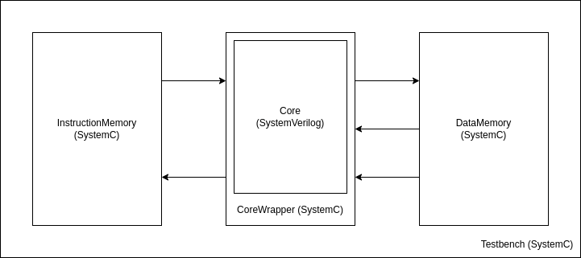

# odyssey-core

Simple RISCV 32 bit processor implemented in the Tang Nano 9K FPGA board. Currently does not implement fault-tollerant methods.

# Requirements

The following software and their version used in the project.

- Icarus Verilog - 13.0
- GTKWave - 3.3.118
- Yosys - 0.40+7 (git sha1 b827b9862, clang++ 14.0.0-1ubuntu1.1 -fPIC -Os)
- SystemC - 3.0.0

# Testbench 

A simple SystemC and SystemVerilog testbench has been created with a focus on the generic validation approach. The testbench runs the code in an assembly file by placcing it on the instruction memory of the CPU and checking the output in the data memory. A simple schematic of the testbench can be seen in the following image.

The following steps can be made to run the testbench:

    1. Configure your SystemC installation path in testbench/systemc/Makefile.config;
    2. Change the testbench/systemc/test.asm script to the desired assembly instructions for the processor to run;
    3. Compile the testbench in the testbench/systemc folder using the Makefile;  

